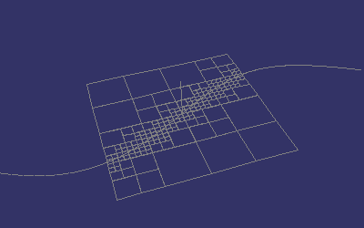

# Crossword Builder

A Crossword Builder which supports unicode

<pre>
==============================================
README: ASYMPTOPIA CROSSWORD BUILDER 3.2
==============================================

Instructions:

Navigate to xw.html.  See the built-in help.  

New features:

* Images no longer used, tiles created dynamically

* Language translations now include:
  Chinese, English, Greek, Estonian, Portuguese-Brazillian,
  Italian, German, Kiswahili, Spanish, French, Russian

* Any unicode can be used

* Tile design improved for readability and appearance

Charles B. Cossé 
ccosse@asymptopia.org
</pre>
